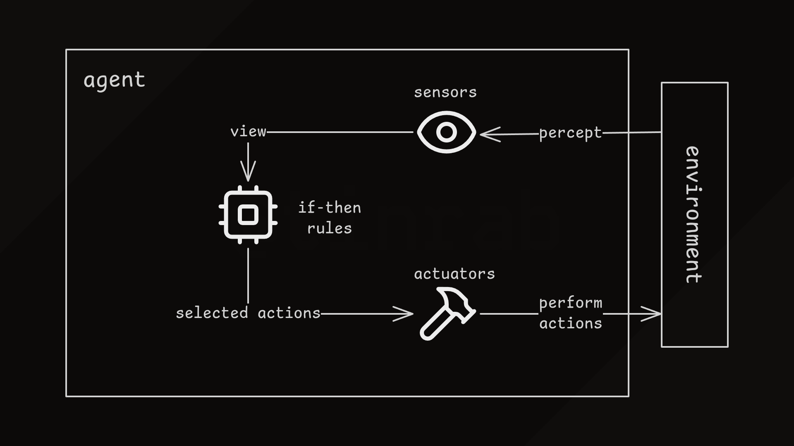
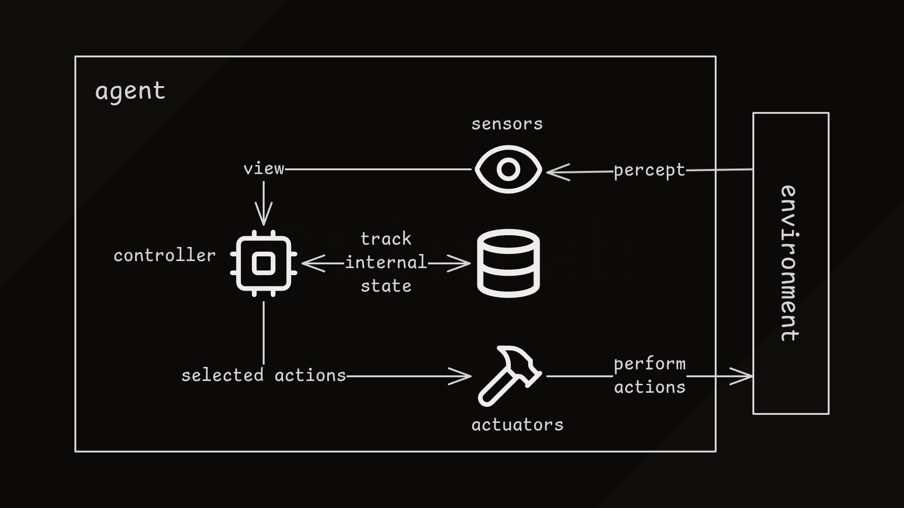
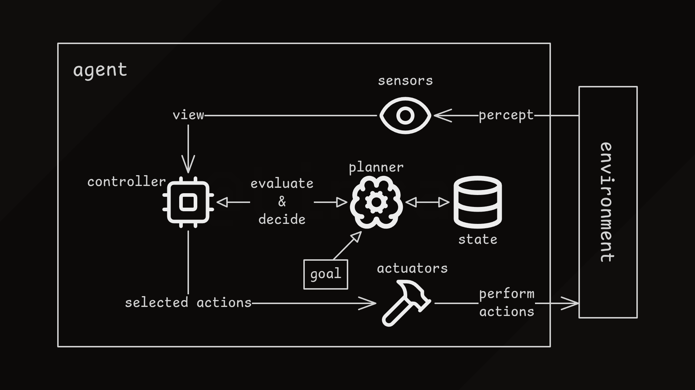
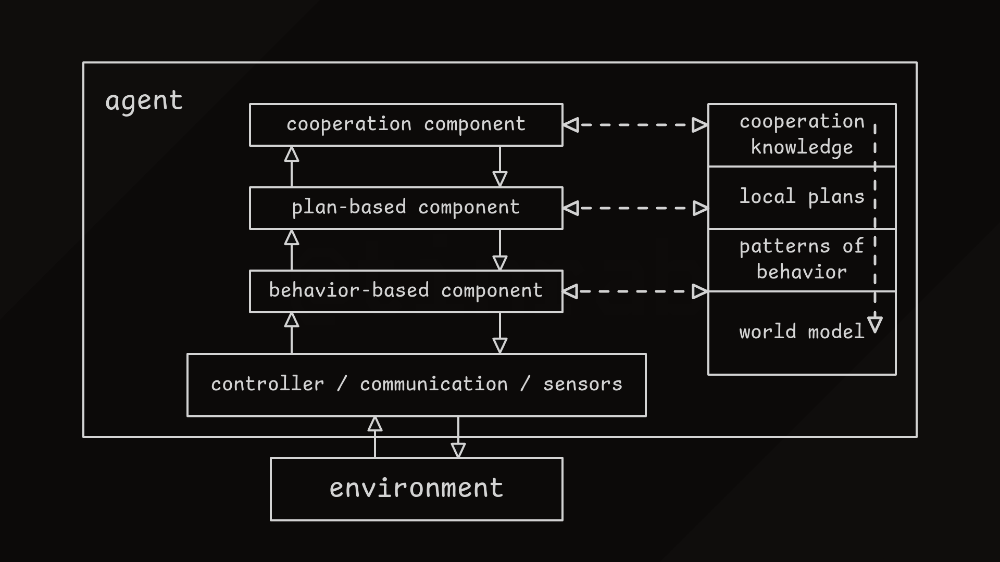
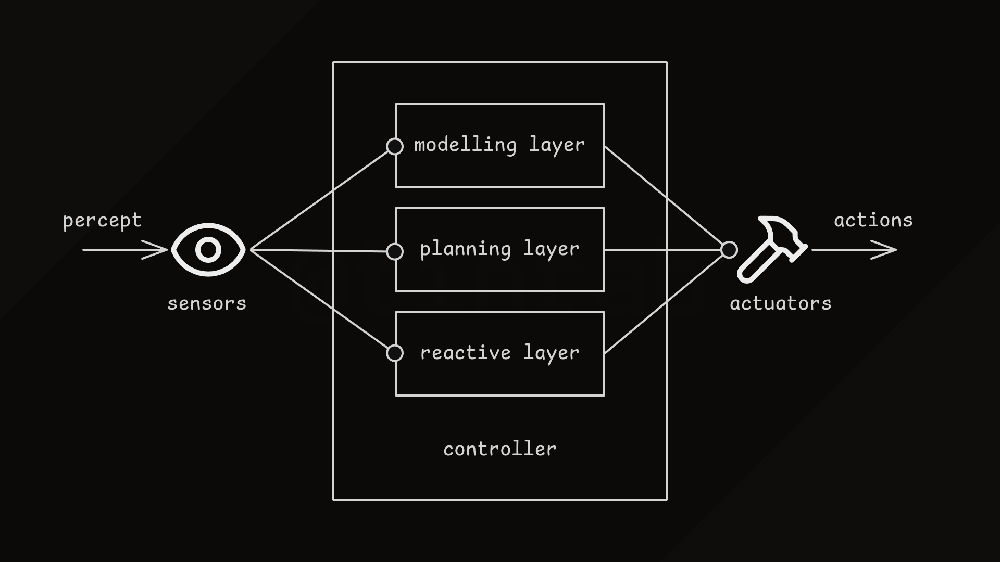

An intelligent agent is a software program that perceives its environment through sensors and responds with actions.

An agent is considered intelligent or rational if it executes actions that lead it to the best outcome.

Agent architectures are high-level descriptions of how intelligent agents work.
Common architectural components can be broken down into parts such as sensors, controllers, and actuators.
Sensors perceive the environment and provide information to the controller, which then selects actions and passes them to actuators to perform.

An agent architecture describes how these components interact with each other.

A few architectures are described below.

# Simple Reflex Agent

Simple "reflex" or "reactive" agents make decisions based on the current state rather than previous experiences.

The controller selects actions based on perceptions and predefined rules.
Rules can be implemented using simple conditional statements, decision trees, behavior trees, large-language models, or any other methods.

For example, in a tower-defense game, the agent might have a rule that says it will shoot at the closest enemy if it is within range.

Another option are behavior trees.
Tree's branches define preconditions, and leaves represent actions.
Essentially, we can model different sets of behaviors based on agent's state.

In a video game, an enemy might have a "lightweight" behavior pattern during day-time and a "deadly" one during night-time.
An example of this in game development can bee seen with Unreal Engine's [behavior trees](https://dev.epicgames.com/documentation/en-us/unreal-engine/behavior-trees-in-unreal-engine).

Unlike simple conditional statements, the agent needs to monitor its internal state (or "internal model") when using behavior trees.

# Goal-Based Agent

A goal-based agent follows a plan that will enable it to achieve a specific goal.

Planning involves searching through the state space to find a sequence of actions that will lead closer to the goal.
An agent can try to find the best possible plan leading to the goal, or it can be more greedy and attempt to satisfy a short-term heuristic.

An example of planning in game development is pathfinding, where agents must find valid paths through the game world.

# Utility-Based Agent

A utility-based agent not only achieves goals but also maximizes a utility function.

While goal-based agents only distinguish between regular states and goal states, utility-based agents also consider how useful a state is.
The utility function determines how good a series of actions is based on current perceptions.

An agent performs actions with the highest utility value.

A utility function helps resolve conflicts between competing decisions, allowing the agent to make compromises.

A utility-based agent could complete pathfinding in the minimum number of steps, which can be more desirable than a goal-based agent.

# InteRRAP Architecture

Hybrid architectures combine the strengths of different architectures, such as the speed of reactivity with strategic planning.

The [InteRRAP architecture](https://scholar.google.com/scholar?hl=en&as_sdt=0%2C5&q=InteRRaP&btnG=) is an example of a hybrid architecture containing three vertically arranged components/layers.

The bottom behavior component deals with reactions and behaviors.
The middle planning component is responsible for building plans that guide the agent towards the goal.
The top cooperation component manages interaction with other agents and enables achieving common goals.

In the figure above, dashed lines indicate information flow between modules, and solid lines show command flows.
A layer communicates with the layer above if it cannot resolve the current state itself.
Decisions produced by one layer are sent downward and also possibly modified.

As an example, the behavior component can use the planning component's plan to execute appropriate actions.

All components are connected to knowledge bases that describe the world at different levels of abstraction.

The hierarchical knowledge is organized in four layers:

- **World Model**: contains the agent's prediction of the world state, which may not be accurate.
- **Behavioral Knowledge**: consists of procedures that the behavior layer executes.
A procedure can be a precondition and several actions to-be executed when the precondition is met.
- **Local Plans**: are hierarchical descriptions of plans containing sub-plans or singular actions.
The planning component executes the plan it believes will bring the agent closer to its goal.
- **Cooperation Knowledge**: contains strategies for cooperation.
These are plans for coordinating multiple agents, resolving conflicts, determining rules for exchanging commands, and evaluating which agents are good "partners" for achieving goals.

# TouringMachines Architecture

The [TouringMachines architecture](https://scholar.google.com/scholar?hl=en&as_sdt=0%2C5&q=TouringMachines+Architecture&btnG=) contains three layers that continuously propose actions for the agent to perform.

Each layer models the agent's world at a different level of abstraction and each is given different task-oriented capabilities.

The reactive layer functions similarly to a simple reflex agent, where a model maps states to actions.
Its purpose is to provide quick reactive capabilities for the agent that higher layers haven't yet evaluated.

The planning layer is responsible for building and executing plans or strategies.
Planning occurs using predetermined "template plans" or "schemas" rather than building plans from the ground up.

The modeling layer enables the agent to predict future states by building an environment model.
Based on the environment model, it creates goals that it forwards to the planning layer, which can then build more informative strategies.

# Conclusion

These were a couple of examples of agent architectures.

An architecture describes how the agent works at a high level, not what it actually does or how it's implemented.

What are the actual sensors, actuators, and controllers are all implementation details.

Sensors, actuators, and controllers can be anything, e.g., keyboard, mouse, smart cars, web APIs, security cameras, webhooks, automated turrets, smart watches, drones, food delivery services, sex toys, bank accounts, Factorio mods, etc.

It's all in how agents perceive the world and how they act on it.
An agent's brain can consist of several conditional statements, an LLM, or anything that aids in decision making.
There are countless ways to build intelligent agents.
