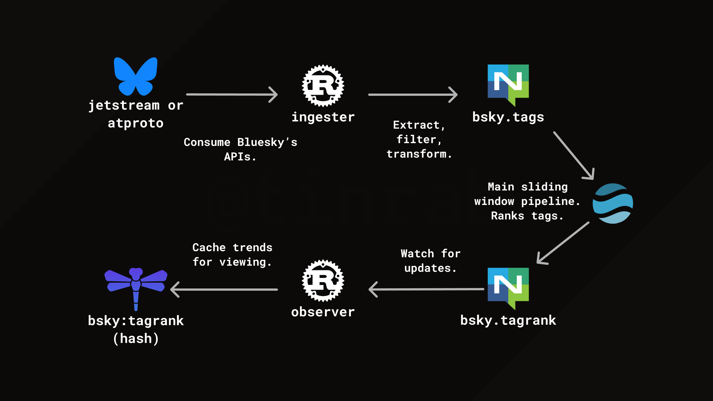

I though about building a trending hashtag system after seeing Bluesky's [Firehose](https://docs.bsky.app/docs/advanced-guides/firehose) API.

Here is the plan:



From a butterfly to a dragonfly.

I'm using Rust because I like it.
I'm using [NATS](https://nats.io) because I like it.
I'm using [Dragonfly](https://www.dragonflydb.io) because it's a faster Redis alternative, and has some nice [built-in features](https://www.dragonflydb.io/docs/managing-dragonfly/cluster-mode) making it easier to use.
[Arroyo](https://www.arroyo.dev) is a stream processing framework I choose because it seemed simple, and has [cool features](https://doc.arroyo.dev/udfs/overview).

When it comes to cloud-native infrastructure tools, I look for simplicity, great docs, and ease of use (especially in dev setups).

The entire source code for this project is available on [GitHub](https://github.com/tinrab/bsky-trending-tag).

# Bluesky APIs

[Bluesky's APIs](https://docs.bsky.app) are based on [ATProto](https://atproto.com), a protocol for building decentralized social networks.
ATProto is fairly low-level, and in practice, you would be using one of the SDKs.
There is a higher-level service sitting on top of ATProto called [Jetstream](https://github.com/bluesky-social/jetstream), which offers a simpler JSON-based API.

To build a trending hashtag system, I'm consuming the Firehose service, which is a streaming API emitting all kinds of events from Bluesky.

For Rust, here are some unofficial SDKs for ATProto and Bluesky:

- [atrium-api](https://crates.io/crates/atrium-api): client for calling ATProto XRPC/HTTP APIs. This requires you to handle ATProto's "frames" yourself.
- [bsky-sdk](https://crates.io/crates/bsky-sdk): client for calling Bluesky APIs. This is built on top of `atrium-api`.
- [jetstream-oxide](https://crates.io/crates/jetstream-oxide): A simple client to consume the Jetstream service. This is what I've used.

There are other SDKs in development, but let's move on.

# Ingesting tags

The first step is to consume the Firehose service, extract and handle tags from posts, and publish them to a NATS subject.

This is done by the "ingester" service.

I am using the Tokio runtime for async work.
I'm approaching this by spawning two tasks: one for consuming the Firehose and another for processing tags.

To manage tasks, you can use a `JoinSet`, which handles a set of tasks spawned on a Tokio runtime.
It allows you to handle errors, cancellations, and graceful shutdowns more easily.

```rust { "fileName": "bsky-ingester-app/src/main.rs" }
let mut task_set = JoinSet::new();

// Set up task cancellation.
let cancel = CancellationToken::new();
task_set.spawn({
    let cancel = cancel.clone();
    async move {
        make_shutdown_signal().await;
        info!("ctrl+c received, exiting...");
        cancel.cancel();

        anyhow::Ok(())
    }
});

// Other tasks...

if let Some(result) = task_set.join_next().await {
    match result {
        Ok(Ok(_)) => {
            // Stopped
        }
        Ok(Err(err)) => {
            error!("{:?}", err);
        }
        Err(err) => {
            error!("task panicked: {:?}", err);
        }
    }
}
```

It's useful to have a single place to log errors.
Throughout the rest of the project, I can simply use `?` to propagate them.
You can also retry tasks in a loop, for example, initially when connecting to a database.
On a `ctrl+c`, we'll cancel all tasks and exit.

Next, I implemented the Jetstream consumer that extracts hashtags ("tags" in ATProto terminology) from posts.

```rust { "fileName": "bsky-ingester-app/src/main.rs" }
let (mut tag_producer, mut tag_consumer) = AsyncHeapRb::<String>::new(1000).split();
task_set.spawn(async move {
    let js = JetstreamConnector::new(JetstreamConfig {
        endpoint: DefaultJetstreamEndpoints::USEastOne.into(),
        wanted_collections: vec!["app.bsky.feed.post".parse().unwrap()],
        wanted_dids: Vec::new(),
        compression: JetstreamCompression::Zstd,
        cursor: None,
    })?;
    let js_receiver = js.connect().await?;

    while let Ok(event) = js_receiver.recv_async().await {
        // Get post records
        if let JetstreamEvent::Commit(CommitEvent::Create { commit, .. }) = event {
            if let KnownRecord::AppBskyFeedPost(record) = commit.record {
                // Extract tags and send them to ringbuffer
                for tag in record
                    .facets
                    .iter()
                    .flatten()
                    .flat_map(|x| x.features.iter())
                    .filter_map(|feature| match feature {
                        Union::Refs(MainFeaturesItem::Tag(tag)) => Some(tag),
                        _ => None,
                    })
                {
                    let _ = tag_producer.try_push(tag.data.tag.clone());
                }
            }
        }
    }

    anyhow::Ok(())
});
```

Tags are contained in the post's record data type.
There are also other things to find, such as embedded images or links.
This is cool because we don't need to parse hashtags out of the text ourselves.

A ring buffer is used to decouple the consuming task from the processing one.
This allows the consuming task to handle processing at its own pace.
If the incoming Jetstream events arrive too quickly, it's okay to drop some.

Finally, tags can be published to a NATS subject.
It would also be possible to do some filtering or transformations here, but I just publish them as-is.

```rust { "fileName": "bsky-ingester-app/src/main.rs" }
task_set.spawn(async move {
    while let Some(value) = tag_consumer.pop().await {
        broker
            .publish(
                TAGS_BROKER_SUBJECT,
                serde_json::to_vec(&TagMessage { value }).unwrap(),
            )
            .await?;
    }

    anyhow::Ok(())
});
```

# How about extracting keywords from text?

My plan for this toy project was just to handle hashtags.
What about parts of text that aren't hashtags, like keywords or broader topics?
I thought about using a keyword extraction algorithm, like YAKE, RAKE, TextRank etc., but I decided to skip that whole area for now.

If you look at X's trending page, it's obvious that something way more complicated is happening under the hood.
It isn't just: hey, extract keywords, remove stop words, and sort by frequency.

After some brief research, I haven't found any good resources on how to do this.
All the "system design" resources I've found about this are missing a lot details, and I'm almost entirely sure that their designs wouldn't actually work in practice.

NLP is hard, and the results I was getting by playing around weren't great.
Also, there are personalized, localization and region-specific trends.
Or how topics extracted from posts with more engagement are more likely to be trending.

Since I was doing stream processing with Arroyo, I though about doing TF-IDF over extracted keywords.
TF-IDF (Term Frequency-Inverse Document Frequency) is only applicable when analyzing sets of documents, because it needs a corpus of documents to calculate "inverse document frequency."
Could you do that over a sliding window of posts in a stream?
Maybe.
I'll look into that another time.

Another option is to use a generic large language model (LLM) for keyword extraction.
The idea is to ask an LLM for a list of keywords from each post.
This will likely give you the best results, but it may not be cost-effective.
Although I think you could use an LLM to preprocess final trends before showing them in the UI.

Maybe I'm overthinking this.

# Stream processing pipeline

Let's continue with the stream processing pipeline.

This is the Arroyo pipeline declared with SQL.

```sql
CREATE TABLE tags (
    value TEXT NOT NULL
) with (
    type = 'source',
    connector = 'nats',
    servers = 'nats:4222',
    subject = 'bsky:tags',
    format = 'json'
);

CREATE TABLE tagtrends (
    value TEXT NOT NULL,
    rank BIGINT NOT NULL
) with (
    type = 'sink',
    connector = 'nats',
    servers = 'nats:4222',
    subject = 'bsky:tagtrends',
    format = 'json'
);

INSERT INTO tagtrends
SELECT value, row_num FROM (
    SELECT *, ROW_NUMBER() OVER (
        PARTITION BY window
        ORDER BY count DESC) as row_num
    FROM (SELECT count(*) as count,
        value,
        hop(interval '5 seconds', interval '15 minutes') as window
            FROM tags
            group by value, window)) WHERE row_num <= 20;
```

This creates a "source" and a "sink," both being NATS.
A sliding window in this case basically means "give me top 20 tags in the last 15 minutes every 5 seconds."
This is the same query as describe in their [docs](https://doc.arroyo.dev/tutorial/mastodon).

# Observing trends and updating views

Similar to the "ingester", there is the "observer" service.
Its responsibility is to subscribe to the NATS subject and update the Redis hash, which can then be queried for the UI.

Just like before, tag ranks are read from a NATS subject into a ring buffer.

```rust { "fileName": "bsky-observer-app/src/main.rs" }
let (mut tag_producer, mut tag_consumer) = AsyncHeapRb::<TagTrendMessage>::new(1000).split();
task_set.spawn(async move {
    let mut subscriber = broker.subscribe(TAG_TRENDS_BROKER_SUBJECT).await?;

    while let Some(message) = subscriber.next().await {
        match serde_json::from_slice::<TagTrendMessage>(&message.payload) {
            Ok(message) => {
                let _ = tag_producer.try_push(message);
            }
            Err(err) => {
                error!("failed to deserialize message: {:?}", err);
            }
        }
    }

    anyhow::Ok(())
});
```

Then inserted into a Redis hash.

```rust { "fileName": "bsky-observer-app/src/main.rs" }
task_set.spawn({
    let cache = cache.clone();
    async move {
        while let Some(value) = tag_consumer.pop().await {
            cache
                .hset(TAG_RANK_CACHE_KEY, &value.rank.to_string(), &value.value)
                .await?;
        }

        anyhow::Ok(())
    }
});
```

The hash structure will look something like this:

```ts
"bsky:tagrank": {
  "1": "work",
  "2": "factorio",
  "3": "anime",
  // ...
  "20": "procrastination",
}
```

I chose a hash over sorted sets because individual hash fields can have expirations ([HEXPIRE](https://redis.io/docs/latest/commands/hexpire/)).
The solution wouldn't require any complex queries; we'd just return the whole hash every time.

```sh { "commandLine": "0" }
redis-cli HGETALL bsky:tagrank
```

# Conclusion

The fact that the Firehose API is free seems insane.
Hopefully it stays that way.

The entire source code for this project is available on [GitHub](https://github.com/tinrab/bsky-trending-tag).
