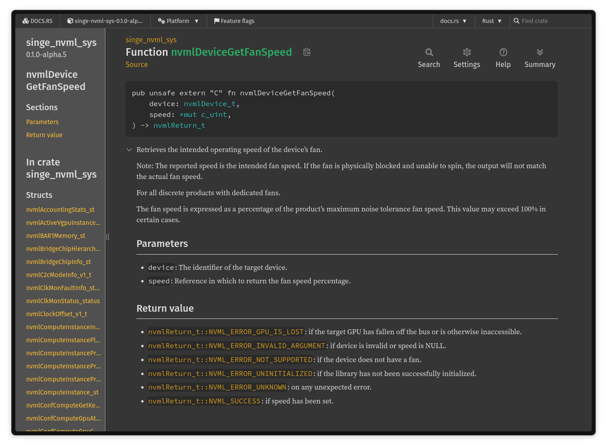

I've been working on [`singe-nvml`](https://crates.io/crates/singe-nvml), a Rust wrapper for NVIDIA Management Library.

NVML is the C API behind a lot of the stuff behind `nvidia-smi`.
It's the management interface exposed by the NVIDIA driver for querying and changing GPU state.

I am building this because I want full control over NVIDIA wrapper crates, make crates use the same style, the same error handling, with a lot of improvements, and more features.

I also document code with doc comments taken directly from official NVIDIA's official docs, with some Rust-specific modifications.
This makes docs easier to navigate, if you're working in Rust.



# Setup

NVML comes from the NVIDIA driver, not the CUDA Toolkit.
The crate needs to find the driver NVML library.

I have a create for finding libraries: [singe-cuda-find](https://crates.io/crates/singe-cuda-find).
It looks through env vars and common installation locations.

Add the crate:

```toml
[dependencies]
singe-nvml = "0.1.0-alpha.7"
```

Note, I am purposefully keeping it _alpha_.

Then initialize NVML:

```rust
use singe_nvml::library::Library;

fn main() -> Result<(), singe_nvml::error::Error> {
    let nvml = Library::create()?;

    println!("driver: {}", nvml.driver_version()?);
    println!("nvml: {}", nvml.version()?);

    Ok(())
}
```

Creating a `Library` calls [nvmlInit_v2](https://docs.nvidia.com/deploy/nvml-api/group__nvmlInitializationAndCleanup.html#group__nvmlInitializationAndCleanup_1gcb6e78434b4d14250ce79c3e7494f06d), then [nvmlShutdown](https://docs.nvidia.com/deploy/nvml-api/group__nvmlInitializationAndCleanup.html#group__nvmlInitializationAndCleanup_1gb276722989cf5e6dc29377a1d07053dc) when it is dropped.

# Basic example

You can list devices and print their stats.

```rust
use singe_nvml::library::Library;

fn main() -> Result<(), singe_nvml::error::Error> {
    let nvml = Library::create()?;
    let count = nvml.device_count()?;

    for index in 0..count {
        let device = nvml.device(index)?;
        let memory = device.memory_info()?;
        let utilization = device.utilization()?;

        println!("GPU {index}: {}", device.name()?);
        println!("  uuid: {}", device.uuid()?);
        println!("  memory: {} / {} MiB used", memory.used / 1_048_576, memory.total / 1_048_576);
        println!("  utilization: {}% gpu, {}% memory", utilization.gpu, utilization.memory);
    }

    Ok(())
}
```

The crate wraps fixed-size C buffers internally and converts C strings to Rust `String`s.

A NVML detail; the device index is not a stable across reboots, while a UUID or PCI bus ID is.

# Temp and power example

You might want to do a health check.

```rust
use singe_nvml::{
    library::Library,
    types::{PerformanceState, TemperatureSensor},
};

fn main() -> Result<(), singe_nvml::error::Error> {
    let nvml = Library::create()?;
    let device = nvml.device(0)?;

    let temperature = device.temperature_reading(TemperatureSensor::Gpu)?;
    let power = device.power_usage()? as f32 / 1000.0;
    let performance_state = device.power_state()?;

    println!("{}: {temperature} C, {power:.1} W, {performance_state:?}", device.name()?);

    if performance_state != PerformanceState::P0 {
        println!("not in P0; this might be idle, power limited, or clock limited");
    }

    Ok(())
}
```

A GPU can be hot, in a lower performance mode, or close to a power cap.
This info might be useful when running benches.

# Fan curve example

This example set GPU's fan speeds based on temperature.

I've used to run something like this as a systemd service.
"nvidia-settings" didn't work on linux with Wayland (still doesn't, afaik).

You can set fan speeds as:

```rust
let fans = device.num_fans()?;
let limits = device.min_max_fan_speed()?;
let current = device.fan_speed(0)?;

device.set_fan_speed(0, current)?;
device.set_default_fan_speed(0)?;
```

The `singe-nvml` has an example in `singe-nvml/examples/fan_curve.rs`.

Here's a snippet:

```rust { "fileName": "singe-nvml/examples/fan_curve.rs" }
const GPU_INDEX: u32 = 0;
const POLL_INTERVAL: Duration = Duration::from_secs(5);
const POLLS: u32 = 1;
const APPLY_CHANGES: bool = false;

const CURVE: &[(u32, u32)] = &[(35, 25), (50, 40), (65, 60), (75, 80), (85, 100)];

fn main() -> Result<(), Box<dyn Error>> {
    let nvml = Library::create()?;
    let device = nvml.device(GPU_INDEX)?;
    let name = device.name()?;
    let fans = device.num_fans()?;
    let fan_limits = device.min_max_fan_speed()?;

    println!("controlling GPU {GPU_INDEX}: {name}");
    println!("fan speed range: {}%-{}%", fan_limits.min, fan_limits.max);
    println!("curve: {CURVE:?}");
    if !APPLY_CHANGES {
        println!("dry run: set APPLY_CHANGES to true to write fan speeds");
    }

    for _ in 0..POLLS {
        // Read the GPU temperature and choose a speed from the curve.
        let temperature = device.temperature_reading(TemperatureSensor::Gpu)?;
        let target_speed =
            fan_speed_for_temperature(temperature).clamp(fan_limits.min, fan_limits.max);

        // Apply the same target to every fan controller on the selected GPU.
        for fan in 0..fans {
            let current_speed = device.fan_speed(fan)?;
            println!("fan {fan}: {temperature} C -> {target_speed}% (currently {current_speed}%)");

            if APPLY_CHANGES && current_speed != target_speed {
                device.set_fan_speed(fan, target_speed)?;
            }
        }

        thread::sleep(POLL_INTERVAL);
    }

    Ok(())
}
```

Changing fan speed needs privileges, so this is a dry-run.

# The sys crate

`singe-nvml` uses raw bindings from [singe-nvml-sys](https://crates.io/crates/singe-nvml-sys).

The sys crate is the low-level FFI layer.
It contains the generated NVML bindings and links against the driver library.

```rust
use singe_nvml_sys as sys;
sys::nvmlInit_v2();
sys::nvmlDeviceGetMemoryInfoV(device, &raw mut memory);
sys::nvmlDeviceSetFanSpeed_v2(device, fan, speed);
```

Most code should use `singe-nvml`.

The safe crate turns `nvmlReturn_t` into `Result<T, Error>`, wraps handles like `Device`, `Unit`, `GpuInstance`, and `VgpuInstance`, turns output parameters into return values, it allocates the fixed NVML buffers internally, maps enums and bitflags into Rust types, and keeps the unsafe calls at the boundary.

NVML has many "call once to get a count, allocate, call again to fill a buffer" APIs.
The wrapper hides that behind `Vec<T>` returns where it can.

# Conclusion

`singe-nvml` is just one create in my own CUDA ecosystem.
Will write more about it in future posts.

- [singe-nvml](https://crates.io/crates/singe-nvml).
- [singe-nvml-sys](https://crates.io/crates/singe-nvml-sys).
